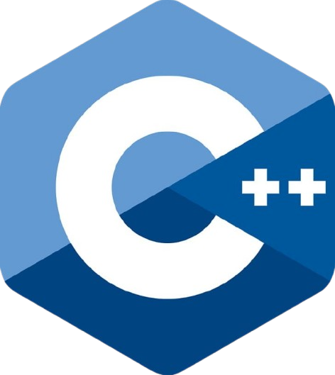
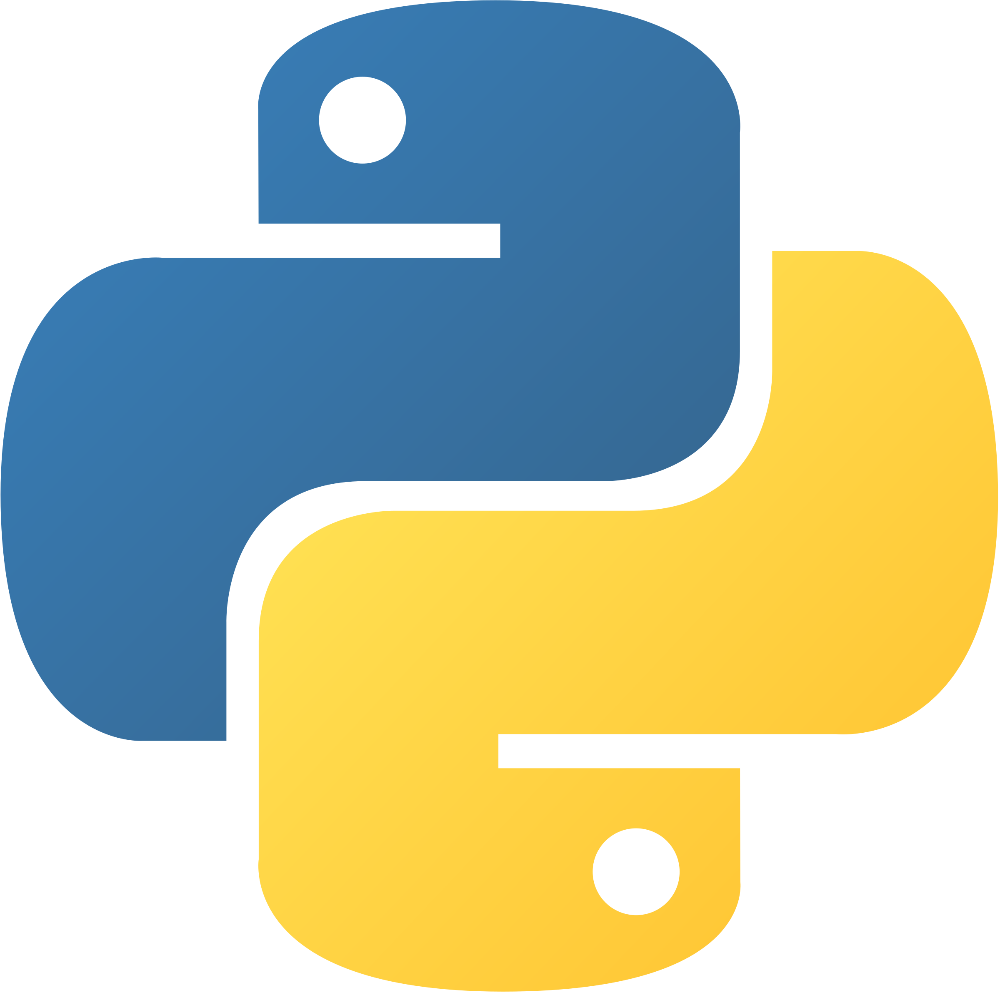
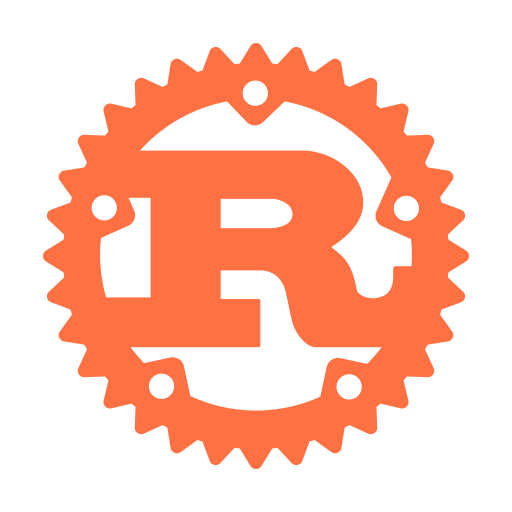
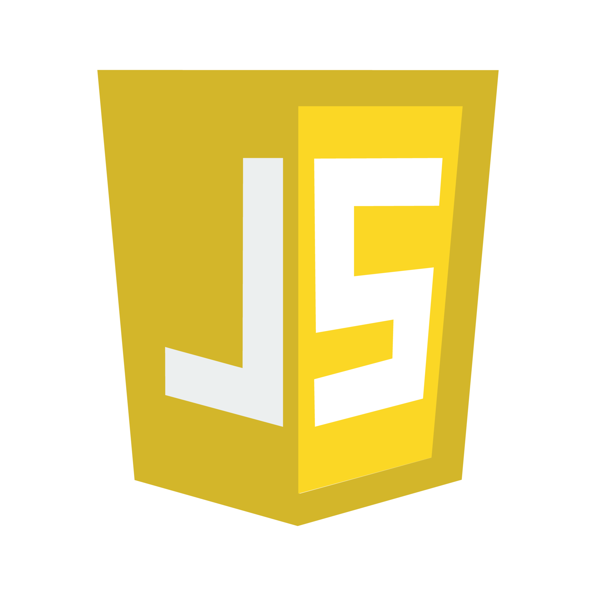
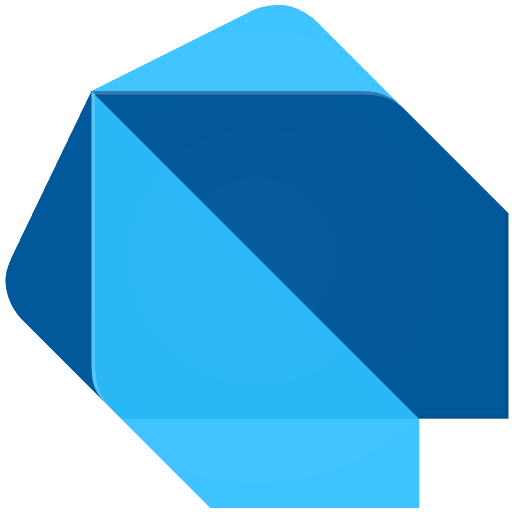

# LeetCode Solutions

**1,057 problems. 9 languages. Two years, every month.**

&nbsp;&nbsp;
&nbsp;&nbsp;
&nbsp;&nbsp;
&nbsp;&nbsp;
&nbsp;&nbsp;
&nbsp;&nbsp;
&nbsp;&nbsp;
&nbsp;&nbsp;

### [**Browse all 1,057 problems →**](docs/problems.md)

